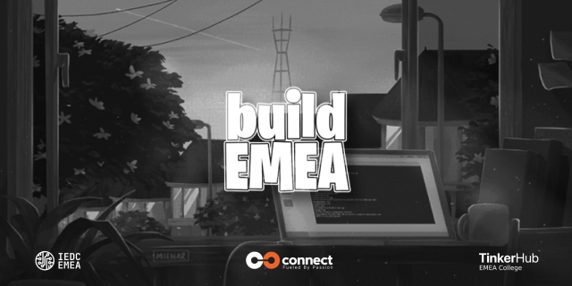

<!--   -->
# Project Name
Resource pool

**Description**:

 Resource.EMEA, your ultimate one-stop resource for students seeking comprehensive study materials, condensed notes, and previous year question papers across various subjects and academic levels. Our platform is dedicated to empowering you with the tools needed to excel in your studies. Whether you're preparing for exams, seeking supplementary learning materials, or aiming to enhance your understanding of specific subjects, Resource.emea provides a curated collection of reliable resources designed to support your academic journey. With our user-friendly interface and 24/7 accessibility, dive into a wealth of educational content that aligns with your learning goals and helps you succeed.

## Team Name
Young Cast

## Team Members
1. Rizwan [[Embed personal GitHub URL](https://github.com/rizwnkt)]
2. Raziya Marzin [[Embed personal GitHub URL](https://github.com/marzinraaz29)]
3. Rinsha [[Embed personal GitHub URL](https://github.com/FathimaRinshaa)]
2. Shifna [[Embed personal GitHub URL](https://github.com/Shifna196)]
2. Nishan [[Embed personal GitHub URL](https://github.com/Nishangith)]

## Link to Product Walkthrough
[[Link to video]](https://www.loom.com/share/0f0f03cc8b8944778e5cf6c1513ec170?sid=989a194c-6f51-4ff5-ac24-16b8644c2137 )

## How it Works ?
1. Explain the working of the project
2. Embed a video of the project demo

## Libraries Used
Library Name - Version

## How to Configure
Instructions for setting up the project

## How to Run
Instructions for running

## In Collaburation With 

  
  
  

